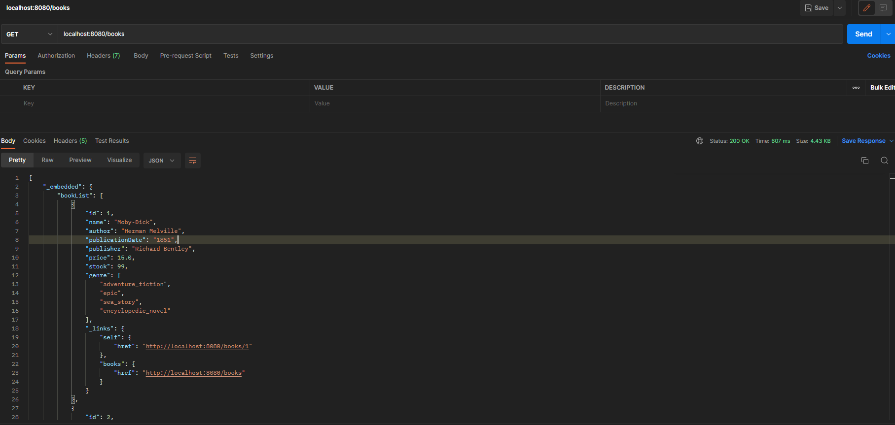
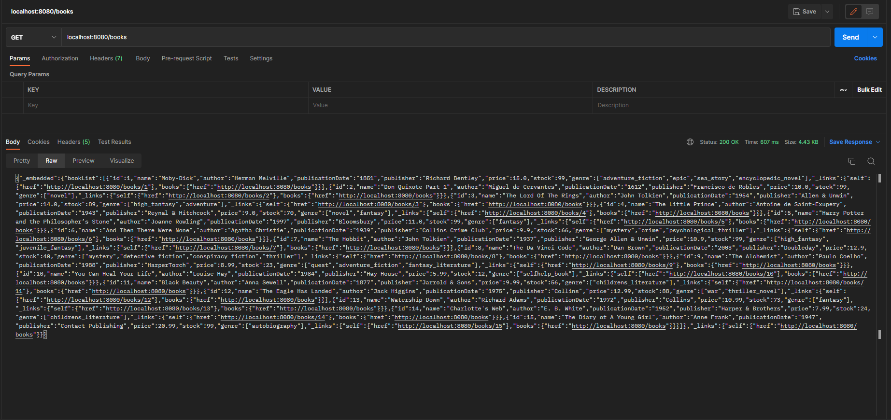
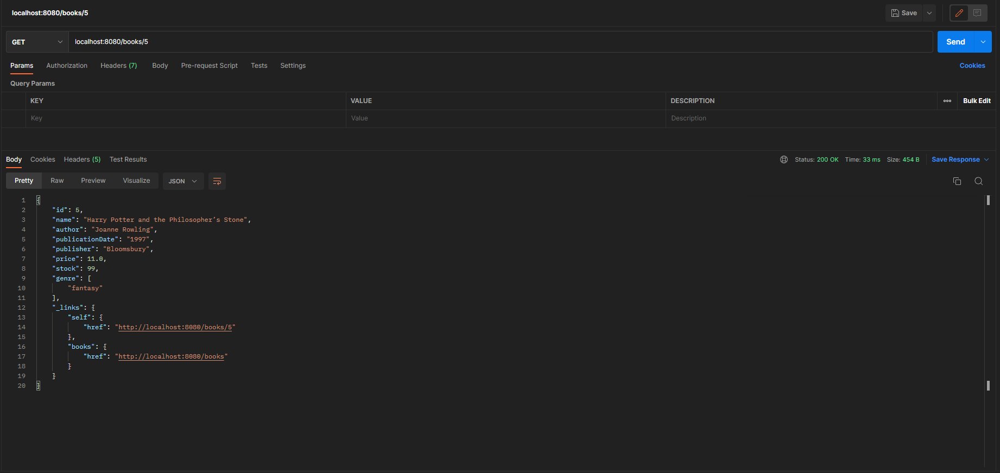
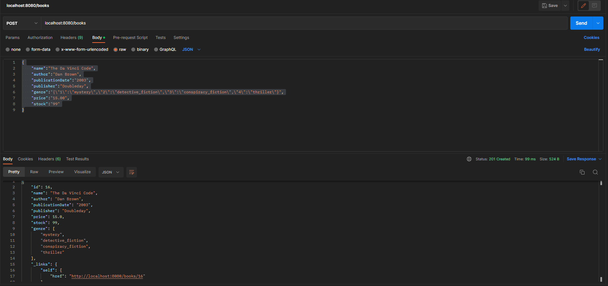
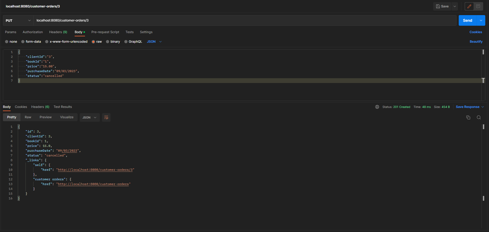
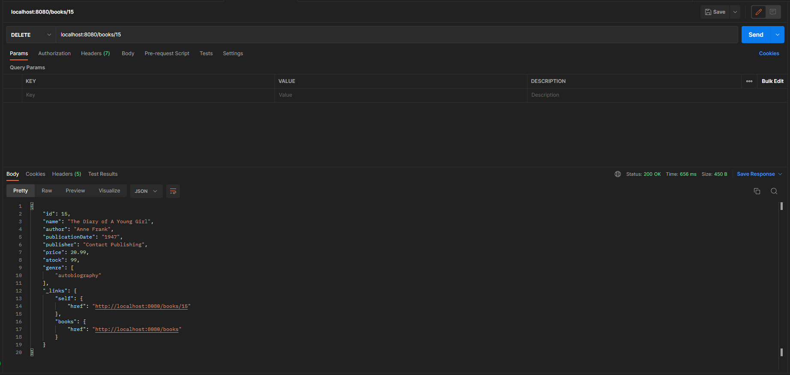
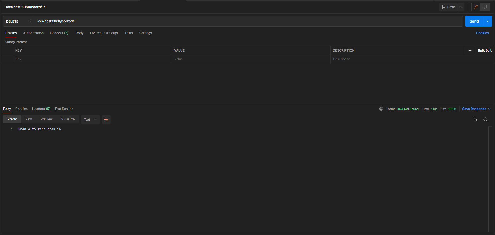

# JavaSpringRESTAPI
 Spring REST API Maven with H2 in-mem database
## Requirements
Java 17 SDK
## Download
[Latest release](https://github.com/sandy6078/JavaSpringRESTAPI/releases/tag/0.0.1)
## Tests
### GET (all)

 
Getting all books with `GET` at `localhost:8080`
 
 

Here is the raw output to prove all books have been fetched
 
### GET (one)

Getting a single book `5` with `GET` at `localhost:8080`
 
### POST

`POST` at `localhost:8080` showing an addition of a new book
 
### PUT

Updating a customer order `3` with the status `cancelled`
 
### DELETE

 
Deleting book `5` and the return body containing the book deleted
 
 

 
An attempt to delete an non existing book
